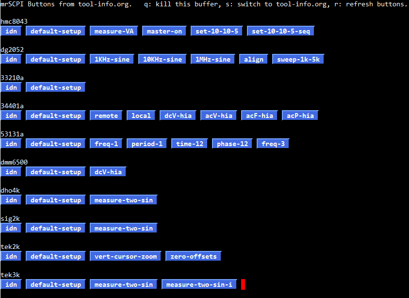

# -*- Mode:Org; Coding:utf-8; fill-column:158 -*-
# ######################################################################################################################################################.H.S.##
# FILE:        index.org
#+TITLE:       mrSCPI
#+SUBTITLE:    Instrument Control Software
#+AUTHOR:      Mitch Richling
#+EMAIL:       http://www.mitchr.me/
#+DESCRIPTION: Documentation for mrSCPI
#+KEYWORDS:    lxi gpib
#+LANGUAGE:    en
#+OPTIONS:     num:t toc:nil \n:nil @:t ::t |:t ^:nil -:t f:t *:t <:t skip:nil d:nil todo:t pri:nil H:5 p:t author:t html-scripts:nil 
#+SEQ_TODO:    TODO:NEW(t)                         TODO:WORK(w)    TODO:HOLD(h)    | TODO:FUTURE(f)   TODO:DONE(d)    TODO:CANCELED(c)
#+PROPERTY: header-args :eval never-export
#+HTML_HEAD: 
#+HTML_HEAD: 
#+HTML_HEAD: 
#+HTML_HEAD: 
#+HTML_HEAD: 
#+HTML_HEAD: 
#+HTML_HEAD: 
#+HTML_HEAD: 
#+HTML_HEAD: 
#+HTML_HEAD: 
#+HTML_HEAD: 
#+HTML_HEAD: 
#+HTML_LINK_HOME: https://www.mitchr.me/
#+HTML_LINK_UP: https://github.com/richmit/mrSCPI
# ######################################################################################################################################################.H.E.##

#+ATTR_HTML: :border 2 solid #ccc :frame hsides :align center
|          <r> | <l>                                          |
|    *Author:* | /{{{author}}}/                               |
|   *Updated:* | /{{{modification-time(%Y-%m-%d %H:%M:%S)}}}/ |
| *Generated:* | /{{{time(%Y-%m-%d %H:%M:%S)}}}/              |
#+ATTR_HTML: :align center
Copyright {{{time(%Y)}}} Mitch Richling. All rights reserved.

#+TOC: headlines 5

#        #         #         #         #         #         #         #         #         #         #         #         #         #         #         #         #         #
#   00   #    10   #    20   #    30   #    40   #    50   #    60   #    70   #    80   #    90   #   100   #   110   #   120   #   130   #   140   #   150   #   160   #
# 234567890123456789012345678901234567890123456789012345678901234567890123456789012345678901234567890123456789012345678901234567890123456789012345678901234567890123456789
#        #         #         #         #         #         #         #         #         #         #         #         #         #         #         #         #         #
#        #         #         #         #         #         #         #         #         #         #         #         #         #         #         #         #         #

# To get org to evaluate all code blocks on export, add the following to the Emacs header on the first line of this file:
#     org-export-babel-evaluate:t; org-confirm-babel-evaluate:nil5

#+MACRO: MRSCPI [[https://richmit.github.io/mrSCPI/][=mrSCPI=]]
#+MACRO: EMACS [[https://www.gnu.org/software/emacs/][Emacs]]
#+MACRO: ORGMODE [[https://orgmode.org/][=org-mode=]]
#+MACRO: OCTAVE [[https://octave.org/][Octave]]/[[https://www.mathworks.com/][Matlab]]
#+MACRO: PARAVIEW [[https://www.paraview.org/][Paraview]]
#+MACRO: SH Bourne shell
#+MACRO: SCPI [[https://en.wikipedia.org/wiki/Standard_Commands_for_Programmable_Instruments][=SCPI=]]
#+MACRO: PROLOGIX Prologix
#+MACRO: MRSCPISRC [[https://github.com/richmit/mrSCPI/blob/main/src/mrSCPI.rb][=mrSCPI.rb=]]
#+MACRO: LXITOOLS [[https://github.com/lxi-tools/lxi-tools][lxi-tools]]

* Introduction
:PROPERTIES:
:CUSTOM_ID: introduction
:END:

From the README:
#+BEGIN_QUOTE
------
#+INCLUDE: "../README.org"
------
#+END_QUOTE

* Interfaces
:PROPERTIES:
:CUSTOM_ID: interfaces
:END:

The {{{MRSCPI}}} ecosystem provides three distinct ways to control {{{SCPI}}} instruments:

 - Ruby API (See the [[#ruby][Ruby API]] section for more detail) ::
   For complex test automation requiring a real programming language.  
   This stateful API is unlike most test automation APIs and naturally compliments the way many {{{SCPI}}} tasks are preformed ... Or at least the way I tend to use {{{SCPI}}}. =;)=

#+begin_src ruby
require_relative 'mrSCPIlib'
SCPIsession.new(:url => '@tek2k',
                :cmd => '*IDN?')
#+end_src

 - {{{MRSCPISRC}}} command ::
   A CLI command providing sophisticated {{{SCPI}}} functionality from the command line -- much like {{{LXITOOLS}}}.

#+begin_src bash
mrSCPI.rb --url @tek2k --cmd '*IDN?'
#+end_src

 - {{{MRSCPI}}} Scripts (See the [[#mrscpi-scripts][Scripts]] section for more detail)  ::
   An efficient scripting language for simple {{{SCPI}}} tasks.  
   Full {{{EMACS}}} {{{ORGMODE}}} Babel support is included enabling instrument control right from your laboratory notebook!

#+begin_src mrscpi
:url @tek2k
:cmd *IDN?
#+end_src

All of these methods use the same underlying infrastructure, and mirror each other in the way they work.  So if you learn how to use one of them, you have
learned how to use them all.

* {{{EMACS}}} as a {{{MRSCPI}}} Interface
:PROPERTIES:
:CUSTOM_ID: emacs-interface
:END:

#+BEGIN_QUOTE
If you don't have any interest in {{{EMACS}}}, then feel free to [[#ruby][skip this section]].
#+END_QUOTE

{{{MRSCPI}}} really has nothing to do with {{{EMACS}}}; however, as an enthusiastic {{{EMACS}}} user, I wanted to be able to use {{{MRSCPI}}} from inside
{{{EMACS}}}!  To that end I have developed a bit of {{{EMACS}}} software to seamlessly integrate {{{MRSCPI}}} into {{{EMACS}}}.  For me, because {{{EMACS}}}
plays a central role in my workflow, this is one of the most important aspects of {{{MRSCPI}}} -- 90% of my {{{MRSCPI}}} use is from within {{{EMACS}}}.  This
section provides some insight into my workflow.  If you are not interested in {{{EMACS}}}, then you can safely skip this section.

** The Laboratory Notebook
I always have my laboratory notebook open at the bench -- just an {{{ORGMODE}}} document loaded up in {{{EMACS}}} running on my bench computer. I have
implemented a major mode for {{{MRSCPI}}} scripts as well as {{{ORGMODE}}} Babel support.  This allows me to embed {{{SCPI}}} commands right inside my notes
making those notes *EXECUTABLE*.  Here is an example excerpt from one of my notebooks:

#+BEGIN_CENTER
[[file:ex-nb01.org][file:pics/ex-nb01_50.png]] \\
[[file:ex-nb01.org][Example Notebook]]
#+END_CENTER 

To make this sort of thing effortless, I have a few scripts that capture instrument configuration details and insert them into my {{{ORGMODE}}} notebook.
Then, when I come back to my experiment some time later, I can have {{{ORGMODE}}} reconfigure all the equipment on my bench to where I left off.

** Test Equipment Notes & Macro Buttons

I keep general test equipment notes in a couple {{{ORGMODE}}} files.  Of cource I include in my notes littel bits of {{{MRSCPI}}} script code for common
things I do with my test equipment.  I could simply put my cursor on those code bits in {{{ORGMODE}}} and execute them, but I wanted a quicker way to access
these code snippits. So I added an {{{EMACS}}} function that finds all the {{{MRSCPI}}} code bits in an {{{ORGMODE}}} document, and produces a GUI window full
of buttons to run them.  This has proven to be super handy, and saves me a ton of time at the bench.  Here is an example of one of my button buffers:

#+BEGIN_CENTER
 \\

#+END_CENTER

** Integrated Data Capture and Analysis

{{{ORGMODE}}} allows us to integrate live code and results from different tools together into a single document.  In this example we integrate code & results
from {{{MRSCPI}}}, {{{OCTAVE}}}, {{{SH}}}, and {{{PARAVIEW}}} in one document:

#+BEGIN_CENTER
[[file:ex-nb02.org][file:pics/lorenz_50.gif]] \\
[[file:ex-nb02.org][Example Document]]
#+END_CENTER

** Setting Up Emacs

I put the {{{MRSCPI}}} stuff in my {{{EMACS}}} dot file directory.  Of course it doesn't need to be in the dot file directory.  That's just where I put it.
If you have some other organizational structure for your auxiliary {{{EMACS}}} files, then feel free to use it!

*** Editing {{{MRSCPI}}} Code: =mrscpi-mode=

A simple mode for {{{MRSCPI}}} scripts is provided in [[https://github.com/richmit/mrSCPI/blob/main/emacs/mrscpi-mode.el][emacs/mrscpi-mode.el]].  This should be *before* your {{{ORGMODE}}} config.

#+begin_src elisp
(if (file-exists-p "~/.emacs.d/mrscpi-mode.el")
    (progn (autoload 'mrscpi-mode "~/.emacs.d/mrscpi-mode.el" "Mode for mrSCPI files")
           (add-to-list 'auto-mode-alist '("\\.mrscpi$" . mrscpi-mode))))
#+end_src

*** {{{ORGMODE}}} Babel Support: =ob-mrscpi.el= & =mrscpi-buttons.el=

A language module for {{{ORGMODE}}} Babel may be found in [[https://github.com/richmit/mrSCPI/blob/main/emacs/ob-mrscpi.el][emacs/ob-mrscpi.el]].  The magical
button maker may be found in [[https://github.com/richmit/mrSCPI/blob/main/emacs/mrscpi-buttons.el][emacs/mrscpi-buttons.el]] -- you don't need this one for
just basic {{{ORGMODE}}} support.  I load these things up at the very end of the {{{ORGMODE}}} setup block in my =init.el= file:

#+begin_src elisp
(if (and (file-exists-p "~/.emacs.d/ob-mrscpi.el") (file-exists-p "~/bin/mrSCPI.rb"))
    (load "~/.emacs.d/ob-mrscpi.el"))
(if (and (file-exists-p "~/.emacs.d/mrscpi-buttons.el") (file-exists-p "~/bin/mrSCPI.rb"))
    (load "~/.emacs.d/mrscpi-buttons.el"))
#+end_src

* Ruby API
:PROPERTIES:
:CUSTOM_ID: ruby
:END:

** API Structure & Philosophy
:PROPERTIES:
:CUSTOM_ID: api-philosophy
:END:

In essence any {{{SCPI}}} program is about managing a communication session state between computer and instrument.  The heart of {{{MRSCPI}}} is the
[[file:rdoc/SCPIsession.html][=SCPIsession=]] class which encapsulates and manages session state.  Session state is represented by named parameters (key-value
pairs).  For example the parameter =:ip_address= stores the IP address for the connection.  As another example, the =:print_results= parameter stores a
boolean value that determines if the results from {{{SCPI}}} commands will be printed.  A few parameters, like =:ip_address=, may only be set when the
[[file:rdoc/SCPIsession.html][=SCPIsession=]] is created.  Other parameters, like =:print_results= may be freely changed at any time.  Parameters are sticky
in that they stay in effect until changed. Using the API always follows the same basic outline:

  1) Create an [[file:rdoc/SCPIsession.html][=SCPIsession=]] object (The =:url=, =:ip_address=, =:net_protocol=, and =:net_port= parameters are used by new)
  2) Set parameters regarding how you want to run {{{SCPI}}} commands
  3) Set the =:cmd= parameter to execute an {{{SCPI}}} command
  4) Go back to 2) till everything is done

See the documentation for the [[file:rdoc/SCPIsession.html][=SCPIsession=]] class for information about all the parameters.

** Example
:PROPERTIES:
:CUSTOM_ID: ruby-example
:END:

In the following example, we pull a PNG screenshot from a Rigol DHO2000/4000 series oscilloscope.  

#+begin_src sh :results output verbatum :exports results :wrap "src ruby :eval never :tangle no"
grep -EA 10000 '(!|#|\*|=|_|-|%|;|C|/){70,}\.H\.E\.' ../../my_prog/screenshot_dho4k.rb | grep -vE '(!|#|\*|=|_|-|%|;|C|/){70,}'
#+end_src

#+RESULTS:
#+begin_src ruby :eval never :tangle no

if ARGV[0] then
  puts("This script will pull a PNG screenshot from a Rigol DHO2000/4000 series oscilloscope.")
  puts("The screenshot file looks like DATESTAMP_DHO.png")
  exit
end

require ENV['PATH'].split(File::PATH_SEPARATOR).map {|x| File.join(x, 'mrSCPI.rb')}.find {|x| FileTest.exist?(x)}

imgFileName = "#{Time.now.localtime.strftime('%Y%m%d%H%M%S')}_DHO.png"
theSPCIsession = SCPIsession.new(:url                => '@dho4k',
                                 :result_macro_block => true,
                                 :print_result       => true,
                                 :out_file           => imgFileName,
                                 :cmd                => ':DISPlay:DATA? PNG'
                                )
puts("screenshot_dho4k.rb: Screen image captured to: #{imgFileName}")
#+end_src

All the magic is in the =SCPIsession.new= call:
 - First we tell it where to connect with =:url=
 - Next we tell {{{MRSCPI}}} that we expect to get a IEEE 488.2 binary block, and that we want {{{MRSCPI}}} to extract that block.
 - With the next two lines we tell {{{MRSCPI}}} to print the result into a file
 - Lastly we tell it the command to use.

You can find this script in my
[[https://github.com/richmit/TestEquipmentScripts][=TestEquipmentScripts=]] github repo with the filename
[[https://github.com/richmit/TestEquipmentScripts/blob/main/screenshot_dho4k.rb][=screenshot_dho4k.rb=]].
   
* {{{MRSCPI}}} Scripts
:PROPERTIES:
:CUSTOM_ID: mrscpi-scripts
:END:

Even if you only want to know about scripts, I encourage you to read the section on [[#api-philosophy][Ruby API Structure & Philosophy]].  To begin,
here is a {{{MRSCPI}}} script version of the Ruby script given in that section:

#+begin_src sh :results output verbatum :exports results :wrap "src mrscpi :eval never :tangle no"
head -n 1 ../examples/dho4ksc.mrscpi
echo
~/core/codeBits/bin/src2orgListing ../examples/dho4ksc.mrscpi
#+end_src

#+RESULTS:
#+begin_src mrscpi :eval never :tangle no
#!/usr/bin/env -S mrSCPI.rb

:url @dho4k                                                                # Connect to my DHO4k
:eval imgFileName=Time.now.localtime.strftime('%Y%m%d%H%M%S') + "_DHO.png" # Filename for PNG
:result_macro_block true                                                   # Expect/Extract a block
:print_result true                                                         # Print the block
:out_file ${imgFileName}                                                   #   into a filename
:cmd :DISPlay:DATA? PNG                                                    # Send the command
#+end_src

Notice how the code parallels the [[#ruby-example][Ruby script above]].  Essentially the {{{MRSCPI}}} script is what was inside the =SCPIsession.new= call in
the Ruby script!  Also note the shebang line (=#!/usr/bin/env mrSCPI.rb=).  This is how we make a {{{MRSCPI}}} script executable on the command line -- just
like a shell script.  The script above may be found in the [[https://github.com/richmit/mrSCPI/blob/main/examples/][=example=]] directory of the {{{MRSCPI}}}
git repository as, [[https://github.com/richmit/mrSCPI/blob/main/examples/dho4ksc.mrscpi][=dho4ksc.mrscpi=]],

Let's take a look at another simple script.

#+begin_src sh :results output verbatum :exports results :wrap "src mrscpi :eval never :tangle no"
~/core/codeBits/bin/src2orgListing ../examples/example.mrscpi
#+end_src

#+RESULTS:
#+begin_src mrscpi :eval never :tangle no
:url @34401a                      # @34401a is an instrument connection "nickname"
:name ids                         # We name the next :cmd that will run
:cmd *IDN?                        # Creates ids variable and stores command result in it
:skip_if ${ids}~34401[aA]         # Checks the result against a regular expression, and skips the next command if it matches
:stop Unknown Device: ${ids}      # This line is skipped if the previous one was true.  Note :stop ends the script.
:print Known Device: 34401A       # The normal script end -- when the regex above matches indicating a recognized device
#+end_src

The script above, [[https://github.com/richmit/mrSCPI/blob/main/examples/example.mrscpi][=example.mrscpi=]], may be found in the =example= directory.  From
that directory, we can run it like so:

#+begin_src sh
mrSCPI.rb -f example.mrscpi
#+end_src

Note that scripts can also be provided on =STDIN=.  If we continue with the previous example, then here is another way to run the script:

#+begin_src sh
mrSCPI.rb -f STDIN <example.mrscpi
#+end_src

Scripts can be described on the command line with arguments instead of being put in a script file.  You simply replace the {{{MRSCPI}}} script commands with
arguments of the same name.  For small scripts with just a couple commands, this can be very handy.  Here is an example:

#+begin_src sh
mrSCPI.rb --url @34401a --cmd '*IDN?'
#+end_src

Note the quotes on the command are required because the asterisk (*) and question mark (?) have special meaning for the shell.

It is possible to combine command line script components arguments *with* a script file.  When we do this it is as if we prepend the script file with the
commands given as arguments.  One thing to note is that the first =:url= option will override any subsequent instances -- this is also true for =:ip_address=,
=:net_port=, & =:net_protocol= as well.  For example we could do something like this to connect to an alternate DMM:

#+begin_src sh
mrSCPI.rb --url @dmm2 example.mrscpi
#+end_src

If we set the verbosity to level 2 (with -V 2), we will see a warning printed about the second =:url= command being ignored.

A common technique is to parameterize things with variables, and then set those variables on the command line.  For example, suppose we wish to set our power
supply up with the first two channels providing analog voltage rails and the third channel providing a voltage for a microcontroller.  We might use a script
like the following:

#+begin_src sh :results output verbatum :exports results :wrap "src mrscpi :eval never :tangle no"
~/core/codeBits/bin/src2orgListing ../examples/power_setup_example.mrscpi
#+end_src

#+RESULTS:
#+begin_src mrscpi :eval never :tangle no
:url @hmc8043
:result_type nil
:delay_after_complete 100
:cmd :OUTPut:MASTer:STATe OFF'
:cmd :INSTrument:NSELect 1; :SOURce:VOLTage:LEVel:IMMediate:AMPLitude ${analog_voltage:10}; :OUTPut:CHANnel:STATe ON
:cmd :INSTrument:NSELect 2; :SOURce:VOLTage:LEVel:IMMediate:AMPLitude ${analog_voltage:10}; :OUTPut:CHANnel:STATe ON
:cmd :INSTrument:NSELect 3; :SOURce:VOLTage:LEVel:IMMediate:AMPLitude ${digital_voltage:5}; :OUTPut:CHANnel:STATe ON
#+end_src

The script above, [[https://github.com/richmit/mrSCPI/blob/main/examples/power_setup_example.mrscpi][=power_setup_example.mrscpi=]], may be found in the
=example= directory.  From that directory, we could set the variables and call the script like this:

#+begin_src sh
mrSCPI.rb -D analog_voltage=15 -D digitial_voltage=3.3 power_setup_example.mrscpi
#+end_src

If we wanted the default values, then we could have just used this:

#+begin_src sh
mrSCPI.rb -f power_setup_example.mrscpi
#+end_src

Inside of {{{EMACS}}} in an {{{ORGMODE}}} code block, we could set these variables via the =src= header arguments like so:

#+begin_example
   #+begin_src mrscpi :output verbatum :var analog_voltage="15" digitial_voltage="3.3"
#+end_example

Note that the "new" commands (=:url=, =:ip_address=, =:net_port=, & =:net_protocol=) can not be parameterized with variables, but they can be overridden.

** {{{MRSCPI}}} Script Syntax

Script syntax is very simple.  Each line starts with an {{{MRSCPI}}} command, and each command is a parameter for one of the following classes:

  - [[file:rdoc/SCPIsession.html][=SCPIsession=]]
  - [[file:rdoc/SCPIsequence.html][=SCPIsequence=]]

* =SCPIrcFile= Class
:PROPERTIES:
:CUSTOM_ID: rcfile
:END:

{{{MRSCPI}}} can use a configuration file to keep track of things like IP addresses, port numbers, protocols, and firewall details.  The
[[file:rdoc/SCPIrcFile.html][=SCPIrcFile=]] class is the primary interface to the information in the RC file.  For the details, see the class
documentation.  The basics can be illustrated with a couple examples:

** =mrNetwork.rb=

This script simply prints out the name of the current host's network as specified in the =.mrSCPIrc= file.

#+begin_src sh :results output verbatum :exports results :wrap "src ruby :eval never :tangle no"
~/core/codeBits/bin/src2orgListing ../src/mrNetwork.rb
#+end_src

#+RESULTS:
#+begin_src ruby :eval never :tangle no
if ENV['MRSCPIPATH'] then                                # First look in MRSCPIPATH
  require File.join(ENV['MRSCPIPATH'], 'mrSCPI.rb')        # Note if MRSCPIPATH is set and require fails, then we want the script to fail!
else
  begin                                                  # Then look in path with the script is
    require_relative 'mrSCPI.rb'
  rescue LoadError
    begin                                                # Then look on LOADPATH
      require 'mrSCPI.rb'
    rescue LoadError                                     # Then look on PATH
      require ENV['PATH'].split(File::PATH_SEPARATOR).map {|x| File.join(x, 'mrSCPI.rb')}.find {|x| FileTest.exist?(x)}
    end
  end
end

puts(SCPIrcFile.instance.lookupNetwork.inspect)
#+end_src

Other than finding and loading {{{MRSCPI}}}, the source above only has one line of code that actually performs any work -- the last line instantiates an
[[file:rdoc/SCPIrcFile.html][=SCPIrcFile=]] object and prints out the network name found in the RC file for the current host.  For example, if we run
this script on my laptop, it will print "=ssh=" because that's what I've named the network in [[#rcfile-example][my personal =.mrSCPIrc=]] file:

#+begin_src sh :results output verbatum :exports both
../src/mrNetwork.rb
#+end_src

#+RESULTS:
#+begin_example
"ssh"
#+end_example

** =teAlias.rb=

This sciprt looks up connection information in the =.mrSCPIrc= file.

#+begin_src sh :results output verbatum :exports results :wrap "src ruby :eval never :tangle no"
~/core/codeBits/bin/src2orgListing ../src/teAlias.rb
#+end_src

#+RESULTS:
#+begin_src ruby :eval never :tangle no
if ENV['MRSCPIPATH'] then                                # First look in MRSCPIPATH
  require File.join(ENV['MRSCPIPATH'], 'mrSCPI.rb')        # Note if MRSCPIPATH is set and require fails, then we want the script to fail!
else
  begin                                                  # Then look in path with the script is
    require_relative 'mrSCPI.rb'
  rescue LoadError
    begin                                                # Then look on LOADPATH
      require 'mrSCPI.rb'
    rescue LoadError                                     # Then look on PATH
      require ENV['PATH'].split(File::PATH_SEPARATOR).map {|x| File.join(x, 'mrSCPI.rb')}.find {|x| FileTest.exist?(x)}
    end
  end
end

if (ARGV.length < 1) || (ARGV.first.match(/^-+[hH]/)) then
  puts("USE: teAlias.rb [format] thingy")
  puts("       thingy is one of netqork@nickname, @nickname, or nickname")
  puts("         network is a network name in the mrSCPIrc file")
  puts("         nickname is a nickname name in the mrSCPIrc file")
  puts("       format is a format string for how to print the result. Default: '%u'")
  puts("         %s -- replaced by the scheme (http, https, soip, etc...)")
  puts("         %h -- replaced by the IP address or DNS name")
  puts("         %p -- replaced by the port number")
  puts("         %u -- replaced by the full URL")
  puts("       Example: telnet `teAlias '%h %p' @foobar`")
  puts("       Example: ssh `teAlias '-p %p %h' @foobar`")
  puts("       Example: chromium-browser `teAlias.rb @foobar`")
  puts("                Works because '%u' is the default format.")
  puts("")
  puts("See SCPIrcFile.lookupURLnickname for full details.")
  exit 0
elsif (ARGV.length == 1) then
  print(SCPIrcFile.instance.lookupURLnickname(ARGV[0]))
elsif (ARGV.length == 2) then
  urlBits = SCPIrcFile.instance.urlParser(ARGV[1])
  print(ARGV[0].gsub('%h', urlBits[:ip_address]).gsub('%s', urlBits[:net_protocol].to_s).gsub('%u', urlBits[:url]).gsub('%p', urlBits[:net_port].to_s))
end

#+end_src

For example, if I wanted to know how to connect to my power supply I could run:

#+begin_src sh :results output verbatum :exports code :eval never
../src/teAlias.rb ps
#+end_src

As mentioned in the [[#rcfile-example][section discussing my personal =.mrSCPIrc=]] file, my bench network is separate from the rest of my home network.
Because of this the connection strings are different depending on where you are connecting from.  If connecting from a computer on my bench, we will get a
different answer than if connecting from my living room.

From the living room:

#+begin_src sh :results output verbatum :exports both
../src/teAlias.rb @ps
#+end_src

#+RESULTS:
#+begin_example
raw://127.0.0.1:9012
#+end_example

From the bench:

#+begin_src sh :results output verbatum :exports both
../src/teAlias.rb @ps
#+end_src

#+RESULTS:
#+begin_example
raw://ps-rns.home.mitchr.me:5025
#+end_example

** Example RC file
:PROPERTIES:
:CUSTOM_ID: rcfile-example
:END:

Here is an example of what my RC file looks like.  I have a subnets for bench (172.16.3.1).  The only access from outside these networks is via SSH to the
bench computer (a raspberry pi named "=bench-pi=").  So when I'm on my bench I can access the test equipment directly, but otherwise I must access the
equipment via SSH tunnels to the bastion server.  This configuration file makes it so that I can specify a connection URL like "=@awg=", and connect to my
33210a AWG regardless of where I'm running the script -- i.e. the library figures out what network I'm on, and expands "=@awg=" into the right thing.

Note that only the first two sections (nicknames & networks) contain RC file entries.  The rest is notes to myself about my network setup.

#+begin_src sh :results output verbatum :exports results :wrap "src perl :eval never :tangle no"
cat ~/MJR/world/dotfiles/.mrSCPIrc--SS-X-X-HOME-X
#+end_src

#+RESULTS:
#+begin_src perl :eval never :tangle no
#####################################################################################################################
# SCPI Nicknames ####################################################################################################
#........CNAME......nicknames.................Directly Connected Network....................ssh to bench-pi...........
nickname 33210ae    33210a    aawge  aawg  => direct@raw://awg-agilent.home.mitchr.me:5025  ssh@raw://127.0.0.1:9001   
nickname 33210aw              aawgw        => direct@https://awg-agilent.home.mitchr.me:443 ssh@https://127.0.0.1:9002   
nickname 34401ap              dmmp         => direct@plgx://gpib-rover.home.mitchr.me:1234  ssh@plgx://127.0.0.1:9003   
nickname 34401as    34401a    dmms   dmm   => direct@soip://serial.home.mitchr.me:10001     ssh@soip://127.0.0.1:9004   
nickname 53131ap    53131a    countp count => direct@plgx://gpib-rover.home.mitchr.me:1234  ssh@plgx://127.0.0.1:9005   
nickname dg2052e    dg2052    dg2ke  dg2k  => direct@raw://awg-rigol.home.mitchr.me:5555    ssh@raw://127.0.0.1:9006   
nickname dg2052w              dg2kw        => direct@http://awg-rigol.home.mitchr.me:80     ssh@http://127.0.0.1:9007   
nickname dho4204e   dho4204   dho4ke dho4k => direct@raw://oscope-rigol.home.mitchr.me:5555 ssh@raw://127.0.0.1:9008   
nickname dho4204w             dho4kw       => direct@http://oscope-rigol.home.mitchr.me:80  ssh@http://127.0.0.1:9009   
nickname dmm6500e   dmm6500   6500e  6500  => direct@raw://dmm-keithley.home.mitchr.me:5025 ssh@raw://127.0.0.1:9010   
nickname dmm6500w             6500w        => direct@http://dmm-keithley.home.mitchr.me:80  ssh@http://127.0.0.1:9011   
nickname hmc8043e   hmc8043   pse    ps    => direct@raw://ps-rns.home.mitchr.me:5025       ssh@raw://127.0.0.1:9012   
nickname hmc8043w             psw          => direct@http://ps-rns.home.mitchr.me:80        ssh@http://127.0.0.1:9013   
nickname sds2504xpe sds2504xp sig2ke sig2k => direct@raw://oscope-sig.home.mitchr.me:5025   ssh@raw://127.0.0.1:9014   
nickname sds2504xpw           sig2kw       => direct@http://oscope-sig.home.mitchr.me:80    ssh@http://127.0.0.1:9015   
nickname serialw              serial       => direct@http://serial.home.mitchr.me:80        ssh@http://127.0.0.1:9016   
nickname tds2024s             tek2ks tek2k => direct@soip://serial.home.mitchr.me:10002     ssh@soip://127.0.0.1:9017   
nickname tds3052bh  tds3052b  tek3kh tek3k => direct@t3k://oscope-tek.home.mitchr.me:80     ssh@t3k://127.0.0.1:9018   
nickname tds3052bp            tek3kp       => direct@plgx://gpib-rover.home.mitchr.me:1234  ssh@plgx://127.0.0.1:9019   
nickname tds3052bs            tek3ks       => direct@soip://serial.home.mitchr.me:10003     ssh@soip://127.0.0.1:9020   
nickname tds3052bw            tek3kw       => direct@http://oscope-tek.home.mitchr.me:80    ssh@http://127.0.0.1:9021   
nickname test                              => direct@raw://127.0.0.1:1234                   ssh@raw://127.0.0.1:1234

#####################################################################################################################
# Networks ##########################################################################################################
#.......Name...Subnet.Mask.....Comment...............................................................................
network direct 172.16.3.0/23   # Bench network with test equipment & bench-pi
network direct 172.16.1.0/23   # Computer desk beside bench
network ssh    172.16.2.0/24   # Isolated work network
network ssh    172.16.4.0/24   # Isolated office network
#+end_src

The SSH tunnels can be automatically created when we ssh to =bench-pi= by placing them in the user specific ssh config file (=~/.ssh/config=):

#+begin_src sh :results output verbatum :exports results :wrap "src text :eval never :tangle no"
grep -B6 LocalForward ~/MJR/world/dotfilesSecure/.ssh/config--SS-X-X-X-mjolnir
#+end_src

#+RESULTS:
#+begin_src text :eval never :tangle no
Host bench-pi.home.mitchr.me bench-pi
  ForwardX11 no
  ForwardAgent no
  IdentitiesOnly yes
  PreferredAuthentications publickey
  IdentityFile ~/.ssh/id_rsa_benchpi_202601031412.priv
  LocalForward 127.0.0.1:5900 oscope-sig.home.mitchr.me:5900
  LocalForward 127.0.0.1:9001 awg-agilent.home.mitchr.me:5025
  LocalForward 127.0.0.1:9002 awg-agilent.home.mitchr.me:443
  LocalForward 127.0.0.1:9003 gpib-rover.home.mitchr.me:1234
  LocalForward 127.0.0.1:9004 serial.home.mitchr.me:10001
  LocalForward 127.0.0.1:9005 gpib-rover.home.mitchr.me:1234
  LocalForward 127.0.0.1:9006 awg-rigol.home.mitchr.me:5555
  LocalForward 127.0.0.1:9007 awg-rigol.home.mitchr.me:80
  LocalForward 127.0.0.1:9008 oscope-rigol.home.mitchr.me:5555
  LocalForward 127.0.0.1:9009 oscope-rigol.home.mitchr.me:80
  LocalForward 127.0.0.1:9010 dmm-keithley.home.mitchr.me:5025
  LocalForward 127.0.0.1:9011 dmm-keithley.home.mitchr.me:80
  LocalForward 127.0.0.1:9012 ps-rns.home.mitchr.me:5025
  LocalForward 127.0.0.1:9013 ps-rns.home.mitchr.me:80
  LocalForward 127.0.0.1:9014 oscope-sig.home.mitchr.me:5025
  LocalForward 127.0.0.1:9015 oscope-sig.home.mitchr.me:80
  LocalForward 127.0.0.1:9016 serial.home.mitchr.me:80
  LocalForward 127.0.0.1:9017 serial.home.mitchr.me:10002
  LocalForward 127.0.0.1:9018 oscope-tek.home.mitchr.me:80
  LocalForward 127.0.0.1:9019 gpib-rover.home.mitchr.me:1234
  LocalForward 127.0.0.1:9020 serial.home.mitchr.me:10003
  LocalForward 127.0.0.1:9021 oscope-tek.home.mitchr.me:80
#+end_src

* Features (current & future)
:PROPERTIES:
:CUSTOM_ID: features
:END:

  - Broad platform support
    - Minimal runtime requirements (base ruby install)
    - Broad OS compatibility (Windows, OSX, Linux, Raspberry Pi OS, etc...)
  - Modern Ruby API for interacting with instruments via SCPI
    - Stateful programming model that compliments the structure of {{{SCPI}}} itself
    - Good control over output (commands, debug, results, etc...)
  - Simple {{{MRSCPI}}} scripting language
    - All the goodness of the Ruby API, but for simple applications
    - Usage that parallels how the Ruby API is used in practice
    - Shebang support for "executable" scripts on UNIX/Linux/Windows MSYS2
    - Support simple programming constructs
      - Conditionals
      - Goto/labels
      - Variables (with variable interpolation)
      - Evaluate ruby one liners and assign results to a variable
      - Stop execution with optional message
      - Print things
    - {{{EMACS}}} {{{ORGMODE}}} Babel support (execution and header variables)
    - {{{EMACS}}} language mode (highlight {{{MRSCPI}}} script code & identify common syntax errors)
  - Protocol/Communication Features
    - {{{SCPI}}} over raw TCP/IP sockets
      - Support for instruments that don't close the TCP connection after the client closes for write
    - Serial (RS-232/RS-485) {{{SCPI}}} over Ethernet via a network attached serial console server
      - Correctly control DTE via TCP/IP socket close
      - Console server port mapping is directly supported via instrument nicknames
    - GPIB {{{SCPI}}} over Ethernet with a {{{PROLOGIX}}} lan controller
      - Correctly configures {{{PROLOGIX}}} controllers to provide :raw mode access
      - Preserves {{{PROLOGIX}}} EPROM values -- and extends life of device memory
      - Uses =:read_timeout_first_byte= to set {{{PROLOGIX}}} =++read_tmo_ms=
      - Uses =:eol= to set {{{PROLOGIX}}} =++eos=
      - Transparently avoids "Query Unterminated" and "-420" errors by using =++auto 0= and calling =++read=
      - Support {{{PROLOGIX}}} specific commands for when to do GPIB reads
    - {{{SCPI}}} over HTTP for TDS3000B series oscilloscopes
      - Works around the lack of raw sockets support by scraping the instrument's web server
  - Flexible timing control
    - Delay after sending a command but before doing a read on the line
    - Timeout to wait for a response to start
    - Timeout to for more data after a successful read
    - Delay before retrying an I/O operation
    - Delay after a command is run and all I/O processed, but before returning a value (or running the next command)
  - Features for {{{EMACS}}} {{{ORGMODE}}} support
    - Option to always return an exit code of 0 -- =org= throws away output from commands with a non-zero exit code
    - Option to not send things to =STDERR= -- =org= only captures =STDOUT=
    - Option for running {{{SCPI}}} scripts on =STDIN=
    - Support for prepending script options/commands via command line
  - A set of standard post-processing steps for results
    - Standard string processing operations:
      - chop (end of line characters)
      - trim white space
      - Extract last word
      - Extract a 488.2 binary block data payload
      - split into an array
        - Binary data can be unpack'ed into native types
        - Binary return blocks can be split into header and payload
        - Strings can be split on 
          - commas
          - semicolons
          - whitespace
          - vertical whitespace
          - regular expressions
          - fixed strings or character sets
          - scan (TODO: future feature)
      - compress sequences of one or more white-space characters into single spaces
      - regex to extract (TODO: future feature)
    - Convert results into numeric Ruby types
      - float or array of floats
      - integer or array of integers
      - boolean or array of booleans (actually tri-state: true, false, or nil)
  - Global Configuration File
    - Keeping track of instrument IP addresses or DNS names
    - Keeping track of port mappings so I can get through the firewall isolating my bench
    - Avoiding the need to type full DNS names or IP addresses
  - A library of regular expression strings for matching 488.2 results and program elements

* FAQ
:PROPERTIES:
:CUSTOM_ID: faq
:END:

** Why don't you use a simple =require= to load {{{MRSCPI}}} in Ruby scripts?
:PROPERTIES:
:CUSTOM_ID: faq-require
:END:

In my scripts, I normally load {{{MRSCPI}}} by searching my =PATH= environment variable like this:

#+begin_src ruby
require ENV['PATH'].split(File::PATH_SEPARATOR).map {|x| File.join(x, 'mrSCPI.rb')}.find {|x| FileTest.exist?(x)}
#+end_src

Why?  I normally put {{{MRSCPI}}} on my path, but I don't want to contaminate my Ruby =LOAD_PATH= by including a generic =bin= directory.  This is just a
personal preference in the way I set up my operating environment.  I expect most people will use something like the followingto load {{{MRSCPI}}}:

#+begin_src ruby
require_relative 'mrSCPI.rb'
#+end_src

** Where can I find more examples?
:PROPERTIES:
:CUSTOM_ID: faq-examples
:END:

I have [[https://github.com/richmit/TestEquipmentScripts][another repository]] for scripts related to test equipment that contains several {{{MRSCPI}}} scripts.

** Where is LXI support?
:PROPERTIES:
:CUSTOM_ID: faq-lxi
:END:

The [[file:rdoc/SCPIsession.html][=SCPIsession=]] class recognizes the protocol symbol =:lxi=; however, I have no plans on implementing direct LXI support in
{{{MRSCPI}}}.  One of the goals of {{{MRSCPI}}} is to be simple and essentially free of external software dependencies, and the complexity of the LXI protocol
would necessitate external dependencies.
